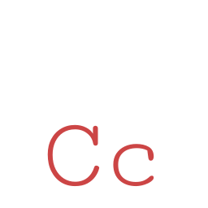

#  CaseConverter

The Extra.CaseConverter library provides a means for transforming strings from one
case to another.

## Installation

The Extra.CaseConverter library can be installed using
[NuGet](https://www.nuget.org/packages/Extra.CaseConverter/).

## Usage

API documentation for the Extra.CaseConverter library may be found
[here](https://jeffrey-w.github.io/Extra.CaseConverter/).

## Contributing

The Extra.CaseConverter library is privately maintained. Please open an issue to
request a feature or report a bug. If you would like to contribute, you may
request an invitation to collaborate on this repository.

## License

[MIT](LICENSE.md)